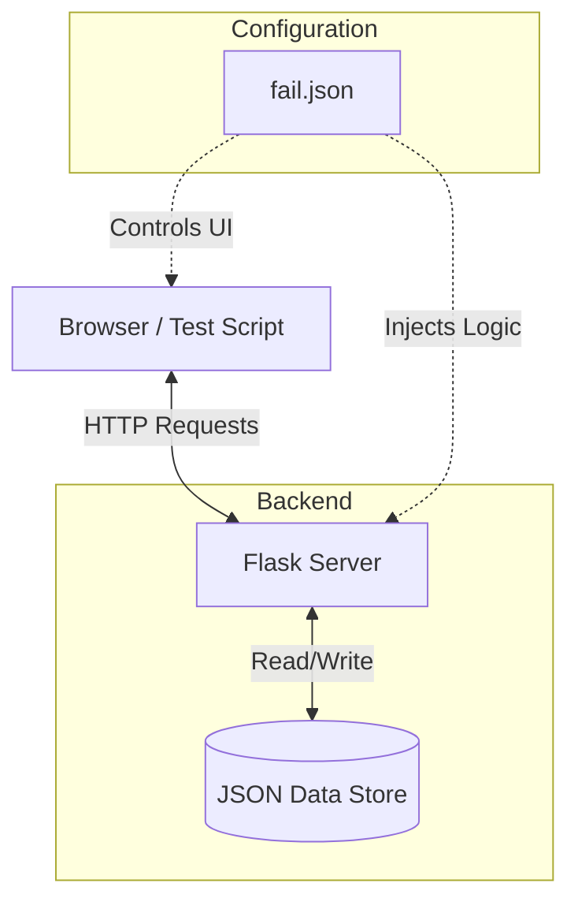

<h1 align="center">Hi, I'm Mohamed 👋</h1>
<h3 align="center">Software Testing Engineer | QA Automation</h3>

  <a href="https://gowano2025.pythonanywhere.com/">Portfolio</a> •
  <a href="https://www.linkedin.com/in/gomaa2022/">LinkedIn</a> •
  <a href="mailto:mohammadgomaa.test@gmail.com">Email</a>

it's important to visit portfolio for organized and updated projects, certifications.
[🔗 Portfolio]([https://github.com/mogomaa2025/ITI-Personal-E-Commerce-Java-Selenium-Automation](https://gowano2025.pythonanywhere.com/))

---

### 👨‍💻 About Me

- ITI & DEPI & Faculity of Engineer Alexandria University Graduation.
- ISTQB FL Certified.
- Top1 Best Graduation Project from MCIT
- Software **Testing** Engineer UI, API, Mobile Manual and Automation.
- Passionate about building maintainable automation frameworks and clean test design.
- Currently mastering **advanced Playwright** and **CI/CD automation**.
- Developed Full Stack **E‑Commerce** Testobject (front-end, back-end, API, database).
- Developed Full Stack [🔗 Portfolio]([https://github.com/mogomaa2025/ITI-Personal-E-Commerce-Java-Selenium-Automation](https://gowano2025.pythonanywhere.com/))

---

### 🧪 Testing & Automation Stack

**UI Automation:** Selenium WebDriver, Playwright, TestNG, Page Object Model, Data Provider Data Driven, Best Pracices Design Patterns
**API Testing:** RestAssured, Postman, API request/response validation
**Backend & Languages:** Python, Java, TypeScript, SQL, C++
**Dev & Tools:** Git, GitHub, GitHub Actions, Allure, Jira Zeyphr

---

## 🧪 Testing Projects

A comprehensive showcase of my automation testing and QA projects with various frameworks and approaches:

### UI Automation Testing

#### [🔗 ITI E-Commerce - Java Selenium Automation](https://github.com/mogomaa2025/ITI-Personal-E-Commerce-Java-Selenium-Automation)

- **Stack:** Java + Selenium WebDriver + TestNG + Page Object Model + Data Provider + Custom Assertions
- **Focus:** End-to-end UI automation for My Full Stack E-commerce platform
- **Website:** https://itigraduation.pythonanywhere.com/

#### [🔗 ITI E-Commerce - TypeScript Playwright UI Automation](https://github.com/mogomaa2025/ITI-Personal-E-Commerce-Typescript-Playwright-UI-Automation)

- **Stack:** TypeScript + Playwright + Page Object Model + Fixture-based setup + Auto Wait + Faker + Monocart Report + Playwright Report
- **Focus:** Modern UI automation using Playwright with TypeScript
- **Features:** Reliability, smart selectors, cross-browser testing

### API & Integration Testing

#### [🔗 ITI E-Commerce - Java REST Assured API Testing](https://github.com/mogomaa2025/ITI-Personal-E-Commerce-Java-Rest-Assured-Automation-Postman)

- **Stack:** Java + RestAssured + Postman Collections + Newman + Maven
- **Scope:** Comprehensive API test suite covering 81+ endpoints
- **Features:** Request/response validation, regression testing, data-driven tests
- **Reporting:** Newman CLI reports + GitHub Actions CI/CD

### Backend & Full-Stack Testing

#### [🔗 ITI E-Commerce - Full Stack Python Flask](https://github.com/mogomaa2025/ITI-Personal-E-Commerce-Full-Stack-Python-Flask)

- **Stack:** Python Flask + JSON-based database + JWT Refresh Tokens + Hashed Passwords
- **Scope:** 81 endpoints e-commerce application for testing
- **Testing Approach:** Complete backend implementation as test object
- **Benefits:** Deep understanding of system under test (SUT) with full database integration

#### [🔗 DEPI Graduation Project - Manual + Automation + API Testing](https://github.com/mogomaa2025/DEPI_GRADUTION_PROJECT)

- **Integrated Testing:** Combines manual, automation, and API testing
- **Components:**
  - 📋 Manual test case design
  - 🤖 UI automation scripts
  - 📡 API test automation
  - 📊 Bug reports & test coverage analysis
- **Focus:** Complete QA lifecycle from planning to reporting

### Specialized Testing Projects

#### [🔗 ThirdEye Testing - Digitopia Real Project](https://github.com/mogomaa2025/ThirdEye-Testing)

- **Project:** Digitopia Third Eye - Real Project Proposal
- **Organization:** Testination Group (Alexandria ITI Branch)
- **Type:** Real-world testing engagement
- **Status:** Production testing experience

#### [🔗 CRM Bug Test Cases](https://github.com/mogomaa2025/crm-bugstestcases)

- **Focus:** Bug identification and test case documentation
- **Type:** CRM system testing and regression suites

---

### 📊 GitHub Stats

---

### 📬 Get in Touch

- 💼 **LinkedIn:** [in/gomaa2022](https://www.linkedin.com/in/gomaa2022/)
- 🌐 **Portfolio:** [gowano2025.pythonanywhere.com](https://gowano2025.pythonanywhere.com/)
- 📧 **Email:** mohammadgomaa.test@gmail.com
- 💬 **GitHub:** [@mogomaa2025](https://github.com/mogomaa2025)

---

  <i>"Quality is not an act, it is a habit." – Aristotle</i>

    <a href="https://gowano2025.pythonanywhere.com/">Explore my portfolio, u will see some thing special →</a>
  <a href="https://github.com/mogomaa2025?tab=repositories">Explore my repositories →</a>

